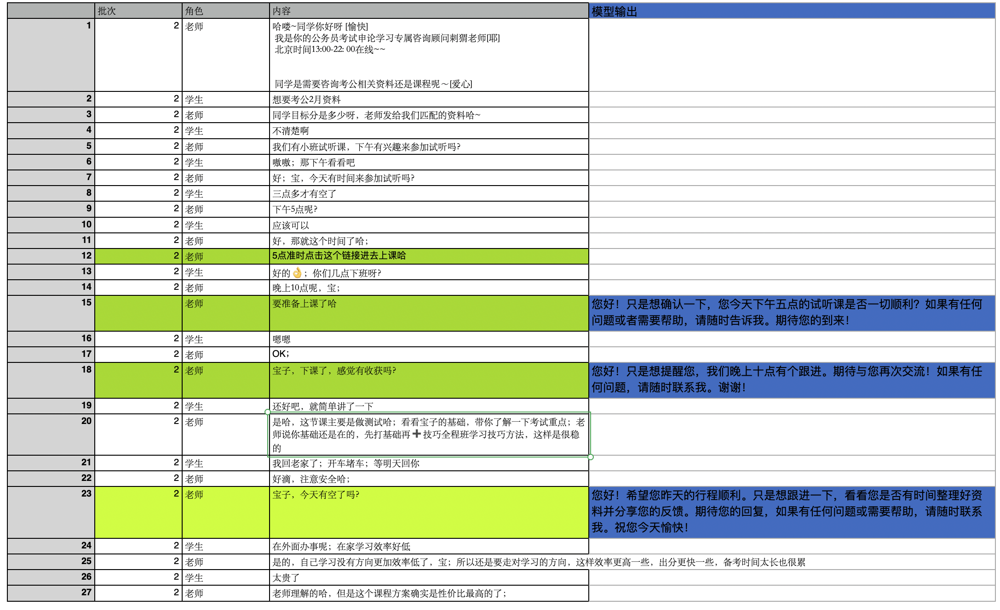

# Follow-up Agent for Customer Service Chatbot

A LlamaIndex-based chatbot agent with intelligent follow-up capabilities for customer service scenarios. The agent can handle both short-term and long-term follow-ups based on conversation context.

## Prerequisites
- OpenAI API Key
- Required packages:
  ```bash
  pip install llama-index openai python-dotenv freezegun
  ```

## Setup
Set your OpenAI API key as an environment variable:
```bash
export OPENAI_API_KEY='your_api_key_here'
```

## Usage
### Process a message
```python
agent = FollowUpAgent(api_key)
response = agent.process_message("我下午3点后有空", "user1")
print(f"Agent: {response.text}")
```
### Check for follow-ups
```python
followup = agent.check_followups()[-1]
followup_msg, followup_type = agent.generate_followup_message(followup)
print(f"Follow-up({followup_type}): {followup_msg}")
```

### Example Results
```
User: 我凌晨1点后有空，到时候再聊吧
Added user message to memory: 我凌晨1点后有空，到时候再聊吧
Follow-up(short_term): 你好！现在已经过了1点，你有空聊聊吗？期待你的回复！
```

## Result on test data
