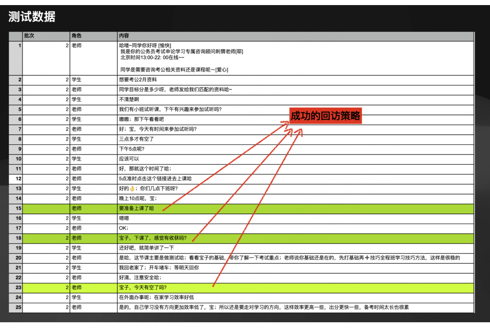

# 任务: Build a follow-up agent - 用LLM为chatbot开发回访策略

我们需要构建一个客服chatbot agent，回答学员关于公务员考试课程辅导的问题。请完成以下代码：

**DUE: 收到题目后第3天凌晨零点。**

注意，您收到题目即表示计时开始，而并非您开始答题表示计时开始。
如，11月7号收到题目，11月10号凌晨零点截止。

## 问题A - (30分):
LlamaIndex框架提供了快速构建LLM agent的能力。请阅读(https://docs.llamaindex.ai/en/stable/examples/agent/openai_agent/) tutorial，用任意一种LLM，跟着教程实现一个chabot。

## 问题B - (70分):
决定客服chatbot能力的一个指标就是agent的回访能力。

例如，
- 短时间回访策略：学员在之前聊天内容里提到"要到今天下午3点后才有空"，客服agent应在下午3点后追问"同学，现在有时间吗？"。

- 长时间回访策略：学员之前提到"现在工作，打算12月全职考公"，客服agent应在12月1号回访，根据之前的聊天内容快速总结学员的需求，形成亲和力的回访话术。

LlamaIndex框架还同时提供了工具调用、聊天Memory管理等功能。请参考LlamaIndex教程 (https://docs.llamaindex.ai/en/stable/understanding/agent/)，用任意一种LLM，实现基于长短memory的学员回访策略，让问题1里的chatbot具有长/短时间回访能力。

请用测试数据，通过人工模拟学员对话，评估你构建的agent的回访能力。

测试数据：[follow-up agent测试数据.xlsx](./data/follow-up+agent测试数据.xlsx)

## 结果

